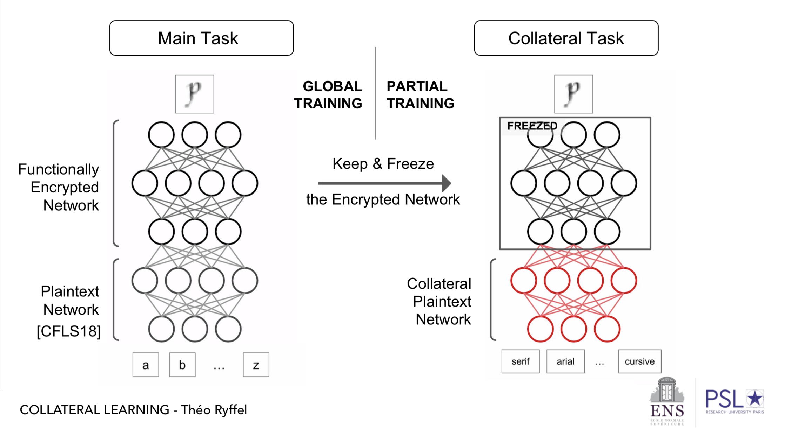

# Collateral Learning

> **TL;DR** We use Functional Encryption combined with Adversarial Learning to perform privacy-preserving neural network evaluation. We provides a wide range of [tutorials](./tutorials) to help you better dive into the project.

## Motivation

Imagine that you train a neural network to perform a specific task, and you discover it has also learned information which makes it possible to perform another completely different task, which is very sensitive. Is this possible? What can you do to prevent this?

**⚠ This shouldn't be confused with the following notions:**
 > **Transfer learning**: You train a model to perform a specific task, and you reuse this pre-trained model to perform a related task on possibly different data. _In collateral learning, the second task is of a different nature while the data used should be closely related to the original one_.
 
 > **Adversarial learning**: You corrupt the input data to fool the model and reduce its performance. _In collateral learning, you don't modify the input but you try to disclose hidden sensitive information about it using the model output_.

## Context

Let's assume you have a semi-private **trained** network performing a prediction task of some nature `pred1`. This means you have a network with the first layers encrypted and the last ones visible in clear. The structure of the network could be written like this: `x -> Private -> output(x) -> Public -> pred1(x)`. For example, `pred1(x)` could be the age based on an face picture input `x`, or the text translation of some speech record.

Several encryption schemes exist, among which Secure Multi-Party Computation (SMPC) and Homomorphic Encryption (HE), but we will consider here a less popular one: Functional Encryption (FE). FE allows a non-trusted party to learn the output of a specific function over encrypted data _without_ interacting with the data owner.

It can be used to encrypt quadratic networks as it is done [in this paper](https://eprint.iacr.org/2018/206) (code is available [here](https://github.com/edufoursans/reading-in-the-dark)), where actually you are even given `x` encrypted (i.e. `Enc(x) -> Private -> output(x) ...`). One reason for this setting with two phases is that encryption is very expensive or restrictive (current FE schemes only support a single quadratic operation), but you can improve the model accuracy by adding a neural network in clear which will leverage the encrypted part's output.

On the testing phase, if you make a prediction on an input, one can only observe the neuron activations starting from the output of the private part, `output(x)` with our notations. Hence, `output(x)` is _the best you can know_ about the original input.

We investigate here how an adversary could query this trained model `x -> Private -> output(x) -> Public -> pred1(x)` with an item `x` for which it's aware it has another feature `pred2(x)` that can be classified. If for example the input `x` is a face picture then `pred2(x)` could be the gender for example, or it could be the ethnic origin of the person talking if `x` is a speech record. The goal of the adversary is to learn another network based on `output(x)` which can perform a prediction task `output(x) -> NN -> pred2(x)` for encrypted items `x`. In particular, the adversary can't alter the `Private` network.

## Use case

*So, what's the use case?* For example, imagine you provide a secure service to write down speech records and people give you encrypted speech records. All you can read and exploit in clear is `output(x)` which can be a relatively short vector compared to `x`, which is enough for you to detect the text and deliver your service. The question is: Can you use `output(x)` to detect the ethnic origin of the person speaking?

## Our approach

We give concrete examples of this in our repository to answer this question. Even if some existing datasets exist that are suitable for two distinct and "relatively" independent learning tasks, like the face dataset [imdb-wiki](https://data.vision.ee.ethz.ch/cvl/rrothe/imdb-wiki/), we have proposed a 60.000 items artificial letter character dataset inspired from MNIST, where several fonts were used to draw the characters, to which extra deformation is added. Hence, we can ensure complete independence between the two features to classify and adjust the difficulty of classification to the current capabilities of Functional Encryption.

Our work is detailed in the [tutorials](./tutorials) section. Any comments are welcome!

## Publication

This work has been submitted and accepted at Neurips 2019:

#### [Partially Encrypted Machine Learning using Functional Encryption](https://arxiv.org/abs/1905.10214)

> Machine learning on encrypted data has received a lot of attention thanks to recent breakthroughs in homomorphic encryption and secure multi-party computation. It allows outsourcing computation to untrusted servers without sacrificing privacy of sensitive data. We propose a practical framework to perform partially encrypted and privacy-preserving predictions which combines adversarial training and functional encryption. We first present a new functional encryption scheme to efficiently compute quadratic functions so that the data owner controls what can be computed but is not involved in the calculation: it provides a decryption key which allows one to learn a specific function evaluation of some encrypted data. We then show how to use it in machine learning to partially encrypt neural networks with quadratic activation functions at evaluation time, and we provide a thorough analysis of the information leaks based on indistinguishability of data items of the same label. Last, since most encryption schemes cannot deal with the last thresholding operation used for classification, we propose a training method to prevent selected sensitive features from leaking, which adversarially optimizes the network against an adversary trying to identify these features. This is interesting for several existing works using partially encrypted machine learning as it comes with little reduction on the model's accuracy and significantly improves data privacy.

It is a joined work from Theo Ryffel, Edouard Dufour-Sans, Romain Gay, Francis Bach, David Pointcheval.

Slides are also available [here](https://www.drauo.de/static/slides/mlfe.pdf)

## Support the project!

If you're enthusiastic about our project, ⭐️ it to show your support! :heart:
